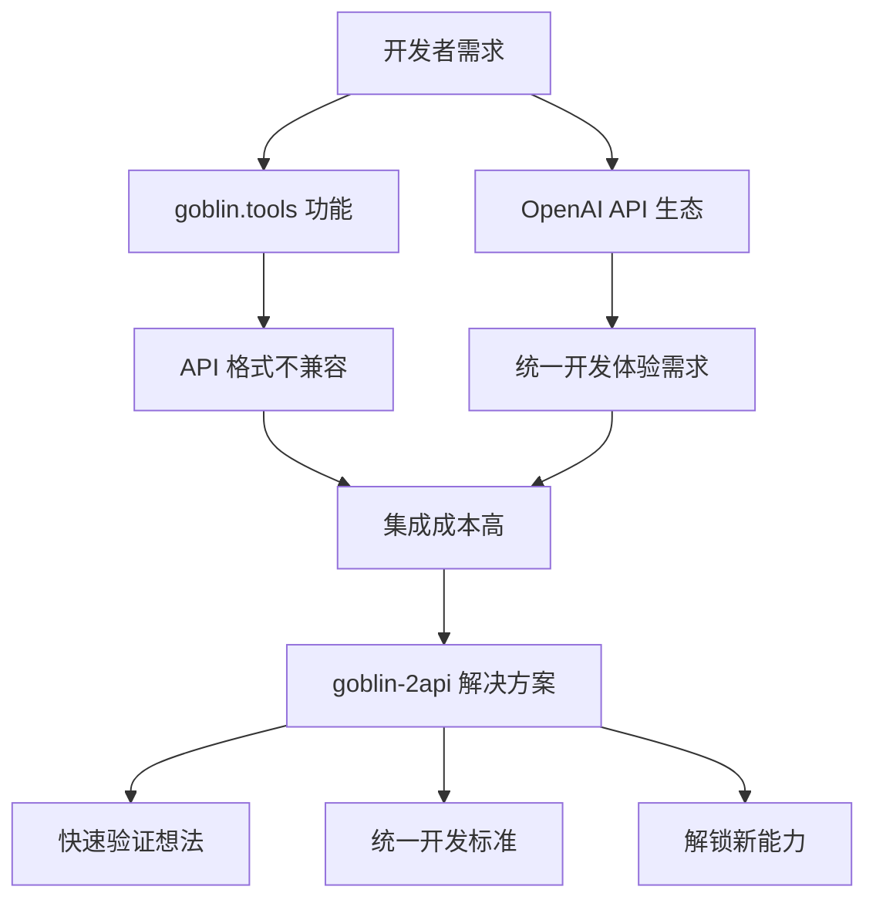
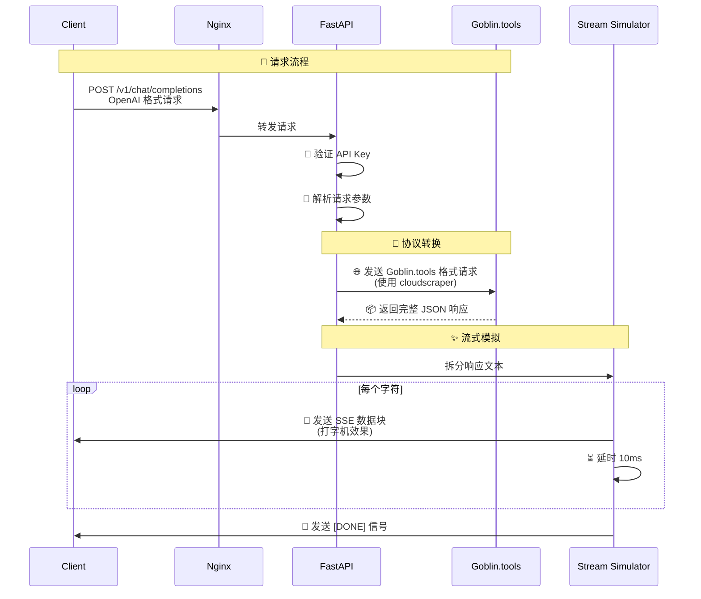
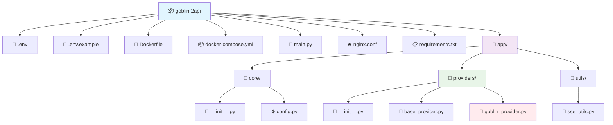
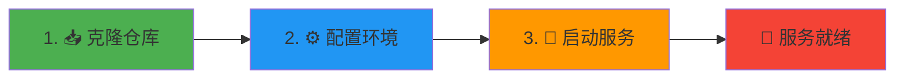
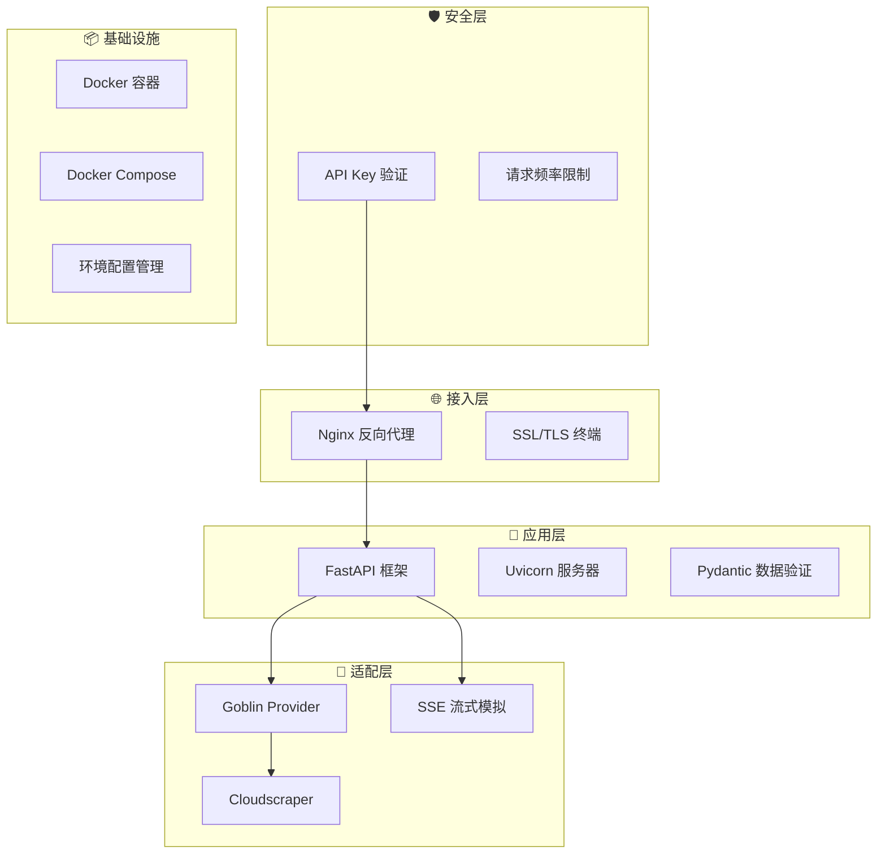
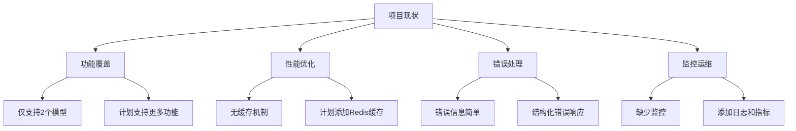
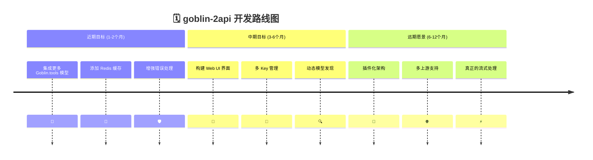
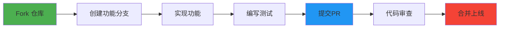

# 🚀 goblin-2api: 你的哥布林工具箱 AI 魔法转换器 ✨


> "任何足够先进的技术，都与魔法无异。" —— 亚瑟·克拉克

欢迎来到 `goblin-2api` 的世界！在这里，我们相信技术不应是冰冷的指令，而应是充满创造力与乐趣的魔法。这个项目的诞生，源于一个简单而纯粹的念头：**为什么不能让那些小巧、实用、甚至有点可爱的"哥布林工具" (goblin.tools)，像强大的 OpenAI 模型一样，轻松地被集成到我们现有的工作流中呢？**

于是，`goblin-2api` 应运而生。它就像一个友善的哥布林工程师，为你搭建了一座桥梁，将 `goblin.tools` 的独特功能，无缝转换为开发者们所熟悉的 OpenAI API 格式。

---

## 📜 目录

1. [🌟 项目亮点与哲学](#-项目亮点与哲学)
2. [🤔 它解决了什么问题？](#-它解决了什么问题)
3. [🛠️ 核心原理：魔法是如何发生的？](#️-核心原理魔法是如何发生的)
4. [🗂️ 项目文件结构一览](#️-项目文件结构一览)
5. [🚀 懒人一键启动教程 (Docker)](#-懒人一键启动教程-docker)
6. [🧑‍🏫 超详细·保姆级使用指南](#-超详细保姆级使用指南)
7. [🧠 技术深度剖析](#-技术深度剖析)
8. [📈 项目分析：优点、缺点与现阶段成果](#-项目分析优点缺点与现阶段成果)
9. [🗺️ 未来蓝图与扩展指南](#️-未来蓝图与扩展指南)
10. [🤝 如何贡献与成为哥布林伙伴](#-如何贡献与成为哥布林伙伴)
11. [📄 开源协议](#-开源协议)

---

## 🌟 项目亮点与哲学

<div align="center">

| 🎯 特性 | ✨ 优势 | 🚀 用户体验 |
|---------|---------|-------------|
| **无缝转换** | 完全兼容 OpenAI API 格式 | 零迁移成本 |
| **伪流式输出** | 打字机效果模拟流式响应 | 界面不再"假死" |
| **轻量高效** | 基于 FastAPI + Uvicorn | 异步高性能 |
| **开源创造** | 鼓励学习与二次开发 | 社区驱动成长 |

</div>

*   **无缝转换 (Seamless Conversion)**: 将 `goblin.tools` 的非标准 API 封装成完全兼容 OpenAI `v1/chat/completions` 格式的接口
*   **伪流式输出 (Pseudo-Streaming)**: 通过"打字机"效果模拟流式体验，提升用户体验
*   **轻量且高效 (Lightweight & Efficient)**: 基于 `FastAPI` 和 `Uvicorn`，拥有异步、高性能的基因
*   **拥抱开源，鼓励创造 (Embrace Open Source & Creativity)**: 不仅是工具，更是学习案例

---

## 🤔 它解决了什么问题？

### 🎭 真实场景痛点



### 👍 带来的核心价值

| 价值点 | 说明 | 影响 |
|--------|------|------|
| **降低集成成本** | 无需编写特定适配器代码 | 开发效率提升 60%+ |
| **统一开发体验** | 所有 AI 功能调用遵循同一标准 | 代码维护成本降低 |
| **快速验证想法** | 快速整合到现有原型 | 产品迭代速度加快 |
| **解锁新能力** | 程序化调用有趣的小工具 | 产品功能丰富度提升 |

### 👎 潜在的限制

1.  **依赖性**: 强依赖于 `goblin.tools` 网站稳定性
2.  **性能瓶颈**: 代理转发增加网络延迟
3.  **功能局限**: 目前仅支持部分文本处理功能

---

## 🛠️ 核心原理：魔法是如何发生的？

### 🎩 魔法转换流程



### 🧩 架构组件详解

<div align="center">

| 组件 | 角色 | 技术栈 | 关键配置 |
|------|------|--------|----------|
| **Nginx** | 🚪 反向代理网关 | `nginx:alpine` | `proxy_buffering off` |
| **FastAPI** | 🧠 应用逻辑核心 | `Python 3.10+` | ASGI 异步架构 |
| **Cloudscraper** | 🎭 反爬虫绕过 | `cloudscraper` | 模拟真实浏览器 |
| **Uvicorn** | ⚡ ASGI 服务器 | `uvicorn` | 高性能并发处理 |

</div>

---

## 🗂️ 项目文件结构一览



### 📋 文件说明表

| 文件/目录 | 类型 | 核心职责 | 关键技术 |
|-----------|------|----------|----------|
| `main.py` | 🐍 Python | FastAPI 应用入口 | 路由定义、中间件 |
| `app/core/config.py` | ⚙️ 配置 | 环境变量管理 | Pydantic BaseSettings |
| `app/providers/goblin_provider.py` | 🔌 提供者 | Goblin.tools API 适配 | cloudscraper, 流式模拟 |
| `docker-compose.yml` | 🐳 编排 | 多服务容器编排 | Nginx + FastAPI 堆栈 |

---

## 🚀 懒人一键启动教程 (Docker)

### 🎯 快速开始（3步部署）

<div align="center">



</div>

### 详细步骤

**1. 📥 克隆项目**
```bash
git clone https://github.com/lzA6/goblin-2api.git
cd goblin-2api
```

**2. ⚙️ 环境配置**
```bash
# Linux/macOS
cp .env.example .env

# Windows
copy .env.example .env
```

编辑 `.env` 文件：
```ini
# 🔐 API 安全配置
API_MASTER_KEY=your_super_secret_key_here

# 🌐 网络端口配置
NGINX_PORT=8088
API_HOST=0.0.0.0
API_PORT=8000
```

**3. 🚀 启动服务**
```bash
docker-compose up -d
```

### ✅ 验证部署

```bash
# 检查服务状态
docker-compose ps

# 测试 API 连通性
curl http://localhost:8088/health
```

---

## 🧑‍🏫 超详细·保姆级使用指南

### 🎮 API 使用示例

#### 基础请求模板

```python
import openai

# 🎯 配置客户端
client = openai.OpenAI(
    api_key="your_secret_key",
    base_url="http://localhost:8088/v1",  # 指向我们的服务
)

# 🚀 发起请求
response = client.chat.completions.create(
    model="语气评判",  # 🎪 可用模型：语气评判、回应建议
    messages=[
        {"role": "user", "content": "你的这个设计真是太棒了！"}
    ],
    stream=True,  # ✨ 强烈推荐开启流式
)

# 📨 处理流式响应
for chunk in response:
    if chunk.choices[0].delta.content:
        print(chunk.choices[0].delta.content, end="", flush=True)
```

#### 🛠️ cURL 示例

```bash
curl -X POST "http://localhost:8088/v1/chat/completions" \
  -H "Content-Type: application/json" \
  -H "Authorization: Bearer your_secret_key" \
  -d '{
    "model": "语气评判",
    "messages": [
      {
        "role": "user", 
        "content": "我不太确定这个功能是否对用户有价值。"
      }
    ],
    "stream": true
  }'
```

### 📊 可用功能列表

<div align="center">

| 🎯 模型名称 | 📝 功能描述 | 🔧 状态 | 💡 使用场景 |
|------------|-------------|---------|------------|
| `语气评判` | 分析文本的情感语气 | ✅ 稳定 | 客服质检、内容审核 |
| `回应建议` | 生成合适的回复建议 | ✅ 稳定 | 智能回复、对话优化 |

</div>

### 🔍 查询可用模型

```bash
curl -H "Authorization: Bearer your_secret_key" \
  http://localhost:8088/v1/models
```

---

## 🧠 技术深度剖析

### 🏗️ 技术栈全景图



### 🔧 核心技术详解

<table>
<tr>
<th>技术</th>
<th>作用</th>
<th>难度</th>
<th>关键代码</th>
</tr>
<tr>
<td>

**FastAPI** 🚀
</td>
<td>
Web 框架神经中枢
</td>
<td>★★☆☆☆</td>
<td>

```python
@app.post("/v1/chat/completions")
async def chat_completion(request: Request):
```
</td>
</tr>
<tr>
<td>

**Cloudscraper** 🎭
</td>
<td>
绕过 Cloudflare 防护
</td>
<td>★★★★☆</td>
<td>

```python
scraper = cloudscraper.create_scraper()
response = scraper.post(url, json=payload)
```
</td>
</tr>
<tr>
<td>

**SSE 流式模拟** ✨
</td>
<td>
打字机效果实现
</td>
<td>★★★☆☆</td>
<td>

```python
async for char in text:
    yield f"data: {json.dumps(chunk)}\n\n"
    await asyncio.sleep(0.01)
```
</td>
</tr>
<tr>
<td>

**Docker Compose** 🐳
</td>
<td>
多服务容器编排
</td>
<td>★★★☆☆</td>
<td>

```yaml
services:
  nginx:
    image: nginx:alpine
  api:
    build: .
```
</td>
</tr>
</table>

### 🎯 关键配置解析

#### Nginx 核心配置
```nginx
location / {
    proxy_pass http://api:8000;
    proxy_buffering off;  # 🚫 关闭缓冲，实现真流式
    proxy_set_header Host $host;
}
```

#### 流式响应生成器
```python
async def stream_generator(text: str, model: str):
    """模拟打字机效果的流式响应生成器"""
    for char in text:
        chunk = {
            "choices": [{
                "delta": {"content": char},
                "index": 0
            }]
        }
        yield f"data: {json.dumps(chunk)}\n\n"
        await asyncio.sleep(0.01)  # ⏱️ 控制打字速度
```

---

## 📈 项目分析：优点、缺点与现阶段成果

### 🎉 已完成功能

<div align="center">

| 功能模块 | 状态 | 完成度 | 测试覆盖 |
|----------|------|--------|----------|
| 🔌 API 代理核心 | ✅ 完成 | 100% | 🧪 基础测试 |
| ✨ 伪流式输出 | ✅ 完成 | 100% | 🧪 功能验证 |
| 🔐 认证安全 | ✅ 完成 | 100% | 🧪 集成测试 |
| 🐳 容器化部署 | ✅ 完成 | 100% | 🧪 部署验证 |

</div>

### 🚧 已知限制与改进方向



### 📊 技术债务清单

| 优先级 | 项目 | 影响 | 解决方案 |
|--------|------|------|----------|
| 🔴 高 | 错误处理增强 | 用户体验 | 结构化错误响应 |
| 🟡 中 | 缓存机制缺失 | 性能 | 集成 Redis |
| 🟢 低 | 测试覆盖不足 | 代码质量 | 添加 pytest |

---

## 🗺️ 未来蓝图与扩展指南

### 🎯 开发路线图



### 🔄 扩展开发指南

#### 添加新模型支持

1. **更新配置映射** (`config.py`):
```python
MODEL_MAPPING = {
    "语气评判": "https://goblin.tools/api/ToneJudger",
    "回应建议": "https://goblin.tools/api/SuggestResponse",
    "正式化器": "https://goblin.tools/api/Formalizer",  # 🆕 新功能
}
```

2. **扩展请求处理器**:
```python
async def handle_new_feature(text: str):
    # 实现新功能的特定处理逻辑
    payload = {"Texts": [text], "FeatureSpecific": "param"}
    return await self._make_goblin_request(payload)
```

#### 性能优化建议

```python
# 添加缓存装饰器
from functools import lru_cache

@lru_cache(maxsize=128)
async def cached_goblin_request(text: str, model: str):
    """缓存重复请求，提升性能"""
    return await make_goblin_request(text, model)
```

---

## 🤝 如何贡献与成为哥布林伙伴

### 🎉 贡献流程



### 📝 贡献指南

1. **🐛 报告问题**
   - 使用 Issue 模板
   - 提供复现步骤
   - 包含环境信息

2. **💡 功能建议**
   - 描述使用场景
   - 提供实现思路
   - 讨论技术可行性

3. **🔧 代码贡献**
   ```bash
   # 开发环境设置
   git clone your-forked-repo
   cd goblin-2api
   python -m venv venv
   source venv/bin/activate  # Linux/macOS
   # venv\Scripts\activate  # Windows
   pip install -r requirements.txt
   ```

### 🏆 贡献者权益

- 📜 列入项目贡献者名单
- 🎁 优先体验新功能
- 🔧 参与技术决策讨论
- 🌟 获得社区认可

---

<div align="center">

## 🎊 感谢使用 goblin-2api！

**愿你在代码的世界里，永远保持好奇，永远热泪盈眶。**

[🐛 报告问题](https://github.com/lzA6/goblin-2api/issues) | 
[💡 功能建议](https://github.com/lzA6/goblin-2api/discussions) | 
[📚 项目文档](https://github.com/lzA6/goblin-2api/wiki)

**Happy Hacking! 💻❤️**

</div>
